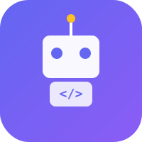
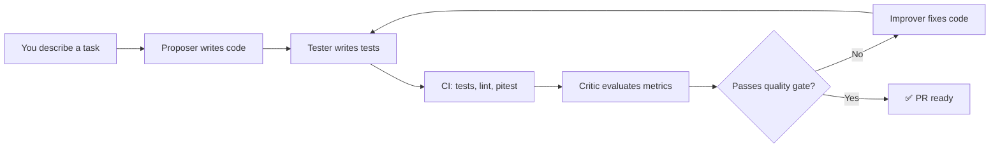

<div align="center">
  

  # Agentry 🤖

  **Multi-Agent Code Review System**

  *Write code, not tickets — AI agents collaborate to build, test, and improve your code through real CI/CD.*

  [](https://github.com/andrey56097/agentry/actions/workflows/build.yml)
  [](https://openjdk.org/projects/jdk/21/)
  [](https://spring.io/projects/spring-boot)
  [](https://gradle.org/)
  [](LICENSE)

</div>

---

## 🌟 Overview

**Agentry** is an autonomous code generation and improvement system. You describe a task in natural language, and a team of AI agents — **Proposer → Tester → Critic → Improver** — iteratively writes, tests, criticizes, and improves code against real CI/CD metrics (not simulated scores).

Every LLM call is tracked: tokens, cost, latency, and quality score. The dashboard shows the full pipeline in real time.

### How It Works



---

## 🏗️ Architecture

Agentry is a **multi-module Gradle** project following a feature-based modular structure:

| Module | Responsibility | Dependencies |
|--------|---------------|--------------|
| `agentry-core` | Domain entities, agent interfaces, pipeline logic | *(pure Java)* |
| `agentry-persistence` | JPA entities, Liquibase migrations, PostgreSQL | `core` |
| `agentry-api` | REST controllers, DTOs, API layer | `core`, `persistence` |
| `agentry-ci-gateway` | GitHub Actions webhooks (`POST /ci-callback`) | `core`, `persistence` |
| `agentry-cli` | Spring Shell console interface | `core` |
| `agentry-dashboard` | React frontend host (future) | `api` |
| `agentry-app` | Spring Boot entry point, configuration | all modules |

### Tech Stack

| Component | Technology | Version |
|-----------|------------|---------|
| Language | Java (OpenJDK) | 21 LTS |
| Framework | Spring Boot | 3.4.x |
| Build | Gradle (Kotlin DSL) | 8.12 |
| Database | PostgreSQL | 16 |
| Migrations | Liquibase | 4.29 |
| CI/CD | GitHub Actions | — |
| LLM | Anthropic Claude API | latest |
| Testing | JUnit 5 + Mockito + Testcontainers | latest |

---

## 🚀 Getting Started

### Prerequisites

- **Java 21** (auto-downloaded by Gradle via foojay toolchain resolver)
- **PostgreSQL 16+** (for persistence layer)

### Build & Test

```bash
# Clone the repository
git clone https://github.com/andriibats/agentry.git
cd agentry

# Build the project (Gradle auto-downloads JDK 21)
./gradlew build

# Run all tests
./gradlew test

# Run a single module's tests
./gradlew :agentry-core:test

# Start the application
./gradlew :agentry-app:bootRun
```

### Quick Start (CLI)

```bash
# Run the CLI without starting the full web app
./gradlew :agentry-cli:bootRun
```

---

## 🧠 Agent Roles

| Role | Prompt | Output |
|------|--------|--------|
| **Proposer** | "Write minimal working code" | Implementation files |
| **Tester** | "Write tests — be critical, find edge cases" | Unit + mutation tests |
| **Critic** | "Evaluate CI metrics" | Score + feedback |
| **Improver** | "Improve code based on feedback" | Fixed implementation |

### Task Budget

Each task has a token budget controlled by the user. Agents **autonomously decide** how to spend it — more on the first draft vs. multiple refinement rounds — making trade-offs between quality and cost.

> *"Remaining budget: 1,850 tokens. Account for this when deciding whether to continue improving."*

---

## 🗺️ Project Roadmap

| Phase | What | Status |
|-------|------|--------|
| — | Project scaffolding (multi-module, CI, Claude Code AI infra) | ✅ Done |
| **1** | Core orchestration + agents + logging | 🚧 Active |
| **2** | Git integration + real CI/CD | 📋 Planned |
| **3** | Dashboard (React + SSE) | 📋 Planned |
| **4** | Automation & hooks | 📋 Planned |
| **5** | Multi-provider agents | 📋 Planned |
| **6** | Memory autodream | 📋 Planned |
| **7** | Real project integration | 📋 Planned |
| **8** | Authorization & BYOK | 📋 Planned |
| **9** | LLM response caching | 📋 Planned |

---

## 🛠️ Development

### Project Structure

```
agentry/
├── agentry-core/             # Domain logic (pure Java)
├── agentry-persistence/      # JPA + Liquibase + Postgres
├── agentry-api/              # REST API
├── agentry-ci-gateway/       # GitHub webhooks
├── agentry-cli/              # Console interface
├── agentry-dashboard/        # Frontend (future)
├── agentry-app/              # Spring Boot app
├── .claude/                  # Claude Code configuration
│   ├── CLAUDE.md             # AI context
│   ├── agents/               # AI agent definitions
│   ├── skills/               # Custom skills
│   └── memory/               # Persistent project memory
├── docs/                     # Documentation
│   ├── specifications/       # System design documents
│   └── plans/                # Implementation plans
└── .github/workflows/        # CI/CD pipelines
```

### Code Conventions

- **Java 21 features**: records for DTOs, text blocks, pattern matching
- **No Lombok**: explicit constructors and getters (or records)
- **Testing**: JUnit 5 + Mockito + Testcontainers
- **Database**: `ddl-auto: validate` — all changes through Liquibase

---

## 🤝 Contributing

This is an open-source pet project. Ideas, issues, and PRs are welcome!

- **Spec & design documents** live in `docs/specifications/`
- **Implementation plans** live in `docs/plans/`
- AI-assisted development is encouraged via `.claude/` config

---

## 📄 License

[MIT](LICENSE)

---

<div align="center">
  <sub>Built with ❤️ by <a href="https://github.com/andriibats">@andriibats</a></sub>
</div>
