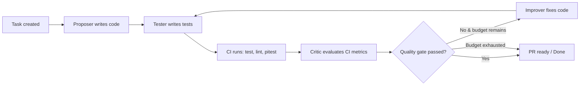

# Agentry — Multi-Agent Code Review System Design

## Overview

Agentry — система, которая принимает задачу на естественном языке и прогоняет через команду AI-агентов (Proposer → Tester → Critic → Improver), взаимодействующих с реальным git-репозиторием и CI/CD-пайплайном. Весь процесс отслеживается через метрики стоимости (токены/$) и качества (score по раундам).

## Architecture Decision Records

### ADR-1: Gradle Kotlin DSL (multi-module)
- **Context:** нужна билд-система с хорошей поддержкой multi-module
- **Decision:** Gradle с Kotlin DSL, type-safe конфигурация
- **Consequence:** более сложный старт, но лучше поддерживаемость модулей

### ADR-2: Postgres + Liquibase
- **Context:** нужна надёжная реляционная БД с versioned миграциями
- **Decision:** PostgreSQL + Liquibase (гибкий контроль миграций, XML/YAML/SQL)
- **Consequence:** чуть больше boilerplate, чем H2, но production-ready

### ADR-3: No Lombok
- **Context:** на Java 21 Lombok избыточен
- **Decision:** не использовать Lombok. Для DTO — Java records. Для бинов — явные конструкторы.
- **Consequence:** чище код, меньше зависимостей, ничего не скрыто от AI

### ADR-4: Feature-module layout
- **Context:** код должен быть удобен для AI-разработки (маленькие модули, чёткие границы)
- **Decision:** модули по бизнес-возможностям: `agentry-core`, `agentry-persistence`, `agentry-api`, `agentry-ci-gateway`, `agentry-cli`, `agentry-dashboard`, `agentry-app`
- **Consequence:** чёткие границы контекста, независимая сборка каждого модуля

### ADR-5: Tester as independent agent
- **Context:** агент, который пишет код, не может объективно его тестировать
- **Decision:** Tester — независимая роль, пишет тесты "со стороны", включая мутационные
- **Consequence:** +1 LLM-вызов на раунд, но качественно лучшие тесты и более честные CI-метрики

## Module Structure

```
agentry                              (root)
├── agentry-core                     (чистый Java, без Spring)
│   ├── src/main/java/com/agentry/core/
│   │   ├── model/                   # Domain entities (Task, AgentRun, CodeVersion, TaskBudget)
│   │   ├── agent/                   # Agent interface, AgentRole enum, AgentDefinition
│   │   ├── llm/                     # ModelProvider interface, LLMResponse record
│   │   ├── pipeline/                # Pipeline orchestrator, QualityGate
│   │   ├── git/                     # GitOperations interface
│   │   └── exception/               # Domain exceptions
│   └── src/test/java/com/agentry/core/
├── agentry-persistence              (Spring: JPA, Liquibase, Postgres)
│   ├── src/main/java/com/agentry/persistence/
│   │   ├── entity/                  # JPA-entity mapping
│   │   ├── repository/              # Spring Data JPA repos
│   │   ├── migration/               # Liquibase config
│   │   └── service/                 # Persistence services
│   └── src/main/resources/db/changelog/
│       ├── db.changelog-master.xml  # Liquibase master
│       └── v001_initial_schema.xml  # Initial schema
├── agentry-api                      (Spring Web: REST, DTO)
│   ├── src/main/java/com/agentry/api/
│   │   ├── controller/              # REST controllers
│   │   ├── dto/                     # Request/Response records
│   │   ├── mapper/                  # DTO <-> Domain mapping
│   │   └── exception/               # API-specific exceptions + handler
│   └── src/test/java/com/agentry/api/
├── agentry-ci-gateway               (Spring Web: webhooks)
│   ├── src/main/java/com/agentry/cigateway/
│   │   ├── controller/              # POST /ci-callback
│   │   ├── model/                   # CI result records
│   │   └── service/                 # CI result processing
│   └── src/test/java/com/agentry/cigateway/
├── agentry-cli                      (Spring Shell: консоль)
│   ├── src/main/java/com/agentry/cli/
│   │   ├── commands/                # Shell commands
│   │   └── printer/                 # Console output formatting
│   └── src/test/java/com/agentry/cli/
├── agentry-dashboard                (React + Spring static)
│   ├── src/main/java/com/agentry/dashboard/
│   │   └── controller/             # Dashboard-specific endpoints
│   └── frontend/                    # React app (future)
└── agentry-app                      (Spring Boot Application — точка входа)
    ├── src/main/java/com/agentry/app/
    │   └── AgentryApplication.java
    └── src/main/resources/
        ├── application.yml          # Основной конфиг
        ├── application-dev.yml      # Dev overrides
        └── application-prod.yml     # Prod overrides
```

### Dependency graph

```
agenty-core  →  (чистый, без dependencies)
agenty-persistence → agentry-core
agenty-api          → agentry-core, agentry-persistence
agenty-ci-gateway   → agentry-core, agentry-persistence
agenty-cli          → agentry-core
agenty-dashboard    → agentry-api (через REST, не напрямую)
agenty-app          → agentry-api, agentry-ci-gateway, agentry-cli, agentry-dashboard
```

## Tech Stack

| Component | Technology | Version |
|-----------|-----------|---------|
| Java | OpenJDK | 21 LTS |
| Framework | Spring Boot | 3.4.x |
| Build | Gradle (Kotlin DSL) | 8.12+ |
| Database | PostgreSQL | 16+ |
| Migrations | Liquibase | 4.29+ |
| Testing | JUnit 5 + Mockito + Testcontainers | latest |
| Mutation Testing | Pitest | latest |
| LLM API | Anthropic Claude API | latest |
| CI/CD | GitHub Actions | — |

## Agent Roles

### Proposer
- **System prompt:** "Напиши минимальный рабочий код для задачи. Используй Java 21, Spring Boot."
- **Output:** файлы с реализацией
- **Budget note:** может тратить больше на первый черновик

### Tester
- **System prompt:** "Напиши тесты для этого кода. Будь критичен — ищи граничные случаи, null-безопасность, исключения. Включи мутационные тесты."
- **Output:** тестовые файлы (unit + integration)
- **Key property:** независим от Proposer — не знает, какие тесты "ожидаются", пишет максимально покрывающие

### Critic
- **System prompt:** "Оцени результаты CI. Тесты: ?% прошло. Mutation score: ?%. Lint errors: ?. Quality gate: ?."
- **Input:** реальные CI-метрики (не текст кода)
- **Output:** score + фидбек для Improver
- **Decision:** approve / request_improvement

### Improver
- **System prompt:** "Улучши код на основе фидбека Critic. Осталось бюджета: N токенов."
- **Output:** исправленные файлы

## Pipeline Flow



## Task Budget

Единственный параметр управления стоимостью. Агенты сами распределяют бюджет внутри цикла.

```java
public record TaskBudget(int totalLimit, int spent) {
    public int remaining() { return totalLimit - spent; }
    public boolean canAfford(int estimatedCost) { return remaining() >= estimatedCost; }
}
```

Перед каждым раундом в промпт передаётся:
> "Осталось N токенов бюджета на эту задачу. Учти это при решении, продолжать ли улучшение."

## CI/CD Pipeline (GitHub Actions)

```yaml
# .github/workflows/build.yml
name: Build & Test
on: [push, pull_request]
jobs:
  build:
    runs-on: ubuntu-latest
    steps:
      - uses: actions/checkout@v4
      - uses: actions/setup-java@v4
        with: { java-version: '21', distribution: 'temurin' }
      - run: ./gradlew check
      - run: ./gradlew pitest  # mutation testing
```

## Claude Code AI Infrastructure

```
.claude/
├── CLAUDE.md                     # Контекст проекта для каждого AI-сеанса
├── agents/
│   ├── spring-developer.md       # Специалист по Spring
│   └── db-migrationist.md        # Специалист по БД
├── skills/
│   ├── agentry-start.md          # Запуск проекта
│   ├── agentry-test.md           # Тестирование
│   └── agentry-new-agent.md      # Шаблон нового AI-агента
├── memory/
│   ├── MEMORY.md                 # Индекс
│   ├── project-structure.md      # Текущая структура
│   └── arch-decisions.md         # ADR
└── settings.local.json           # Permission overrides
```

## Database Schema (Stage 1)

### Core tables

```sql
CREATE TABLE tasks (
    id UUID PRIMARY KEY,
    description TEXT NOT NULL,
    status VARCHAR(20) NOT NULL DEFAULT 'pending',  -- pending, in_progress, review, done
    budget_limit INT NOT NULL,
    budget_spent INT NOT NULL DEFAULT 0,
    quality_gate_score INT,
    git_branch VARCHAR(255),
    created_at TIMESTAMP NOT NULL,
    updated_at TIMESTAMP NOT NULL
);

CREATE TABLE agent_runs (
    id UUID PRIMARY KEY,
    task_id UUID NOT NULL REFERENCES tasks(id),
    round INT NOT NULL,
    agent_role VARCHAR(20) NOT NULL,  -- proposer, tester, critic, improver
    prompt_tokens INT NOT NULL,
    completion_tokens INT NOT NULL,
    cost_usd DECIMAL(10,6) NOT NULL,
    latency_ms INT NOT NULL,
    score INT,
    created_at TIMESTAMP NOT NULL
);

CREATE TABLE code_versions (
    id UUID PRIMARY KEY,
    task_id UUID NOT NULL REFERENCES tasks(id),
    round INT NOT NULL,
    agent_role VARCHAR(20) NOT NULL,
    file_path VARCHAR(500) NOT NULL,
    content_hash VARCHAR(64) NOT NULL,
    created_at TIMESTAMP NOT NULL
);
```

## Quality Gate (Stage 1 defaults)

Thresholds для перехода к следующей итерации (настраиваются):
- Tests passed: 100%
- Mutation score: >= 75%
- Lint errors: 0
- Coverage: >= 80%

## Implementation Plan (next: writing-plans skill)

1. Scaffold Gradle multi-module project
2. Create `.claude/` AI infrastructure
3. Implement `agentry-core` — domain entities + interfaces
4. Implement `agentry-persistence` — JPA + Liquibase
5. Implement `agentry-api` — REST endpoints
6. Implement `agentry-cli` — console runner
7. Implement `agentry-app` — Spring Boot application
8. Set up GitHub Actions CI
9. Implement Claude API integration (ModelProvider)
10. Implement pipeline: Proposer → Tester → Critic → Improver loop
